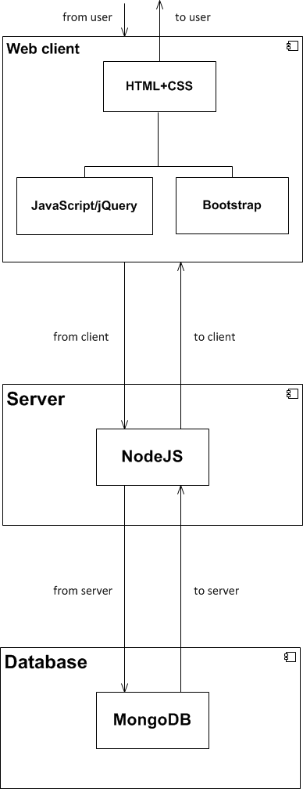

#System Architecture (Beta)

###Tech Stack

####Client-side:
* JavaScript:
    * will be used to create dynamic web pages which the user will use to interact with the service
    * used to implement the core functionality of the service

* jQuery:
    * used to facilitate interactivity and event handling
    * jQueryUI will be used to implement the services user interface

* HTML+CSS:
    * used to create and render the services web pages
    * modern standards will be followed allowing for compatibility across all modern browsers

####Server-side:
* NodeJS:
    * the foundation of the service, will serve web pages to the browser and store the database
    * connects to the database to allow data to be sent and received from the front-end of the service

* MongoDB:
    * modern NoSQL database to store the necessary persistent data of the service (including users and invetories)

###Architecture Diagram:

